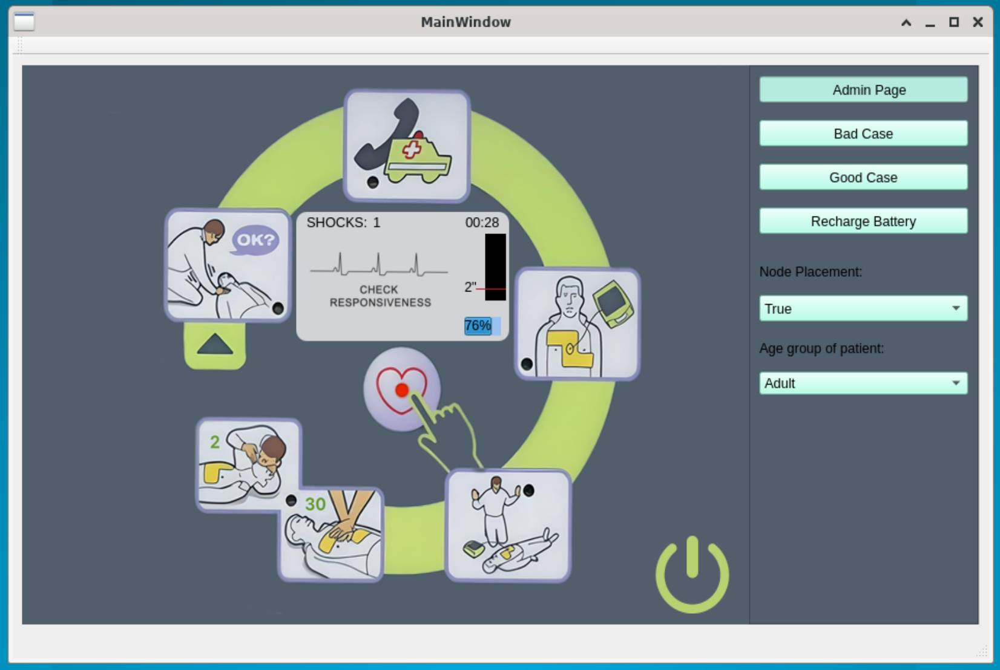

# AED Software Prototype

### Project Overview
This repository hosts our software-based prototype of an Automated External Defibrillator (AED), designed to simulate the functionalities and user interactions of a real-world AED. Our goal is to provide a comprehensive and accurate training tool for emergency responders.

### Deliverables
- **Software Prototype**: A fully functional AED simulation.
- **Documentation**: Detailed use cases, design patterns, UML and sequence diagrams.

### Technologies Used
- **Qt Framework**: For GUI development and main application logic.
- **C++**: Primary programming language.
- **UML Tools**: For creating diagrams.

### Features
- Simulated scenarios (good case, bad case).
- Interactive GUI mimicking real AEDs software.
- Educational resources and documentation.

### Usage
The prototype serves as a training tool for emergency responders, demonstrating the use of AED in various scenarios.

